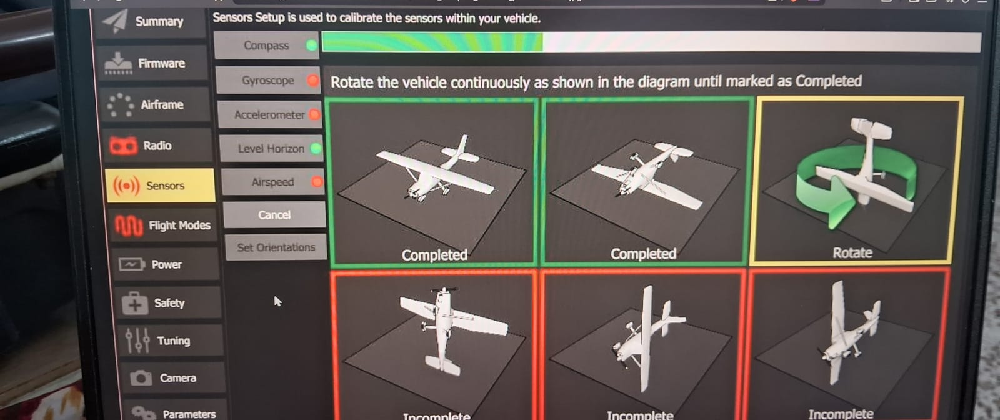
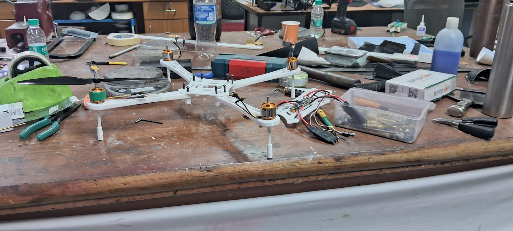
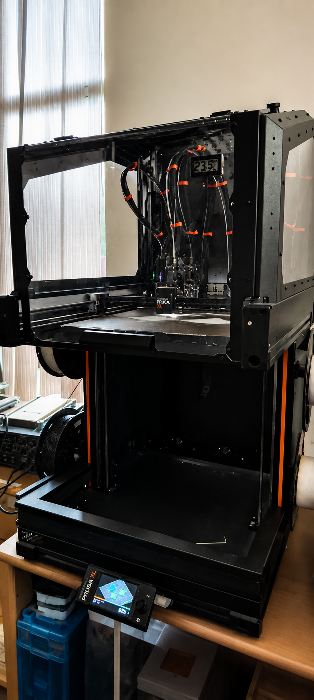
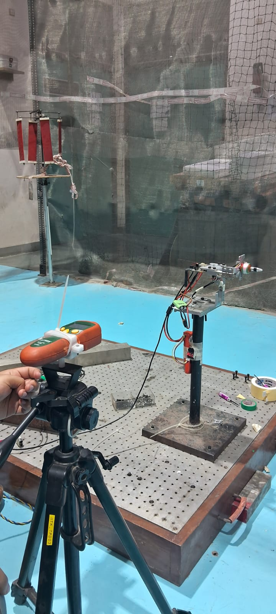
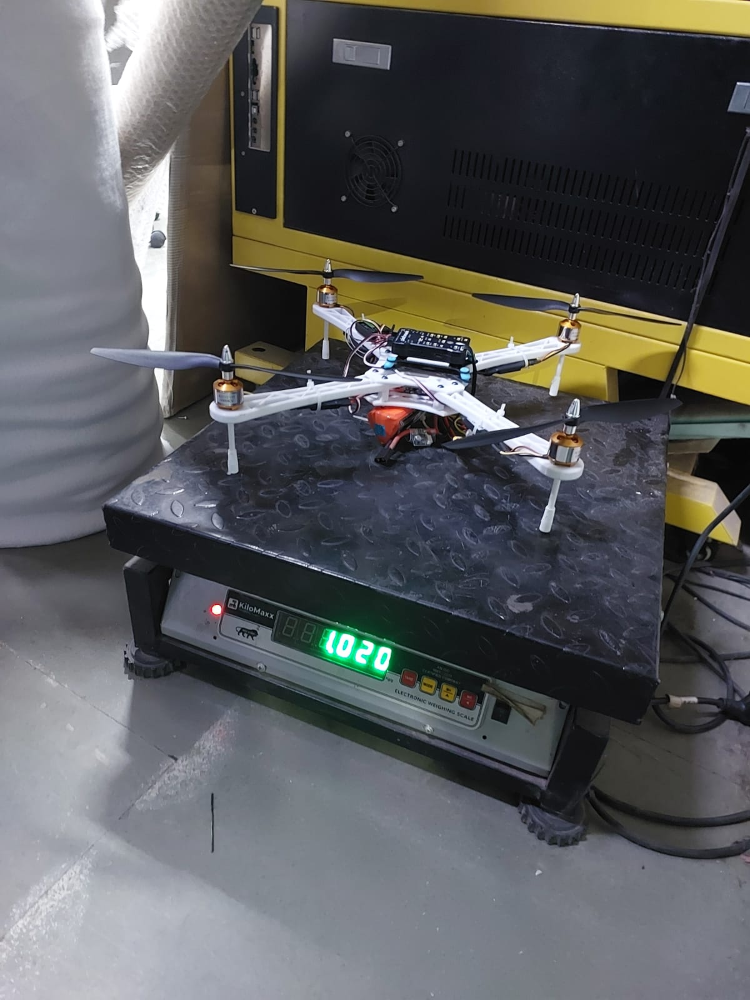
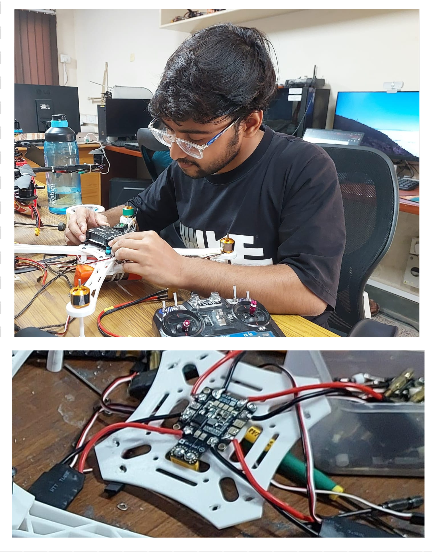
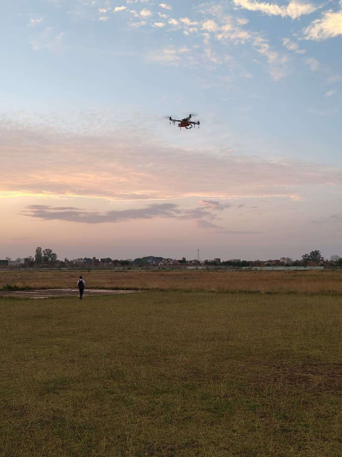
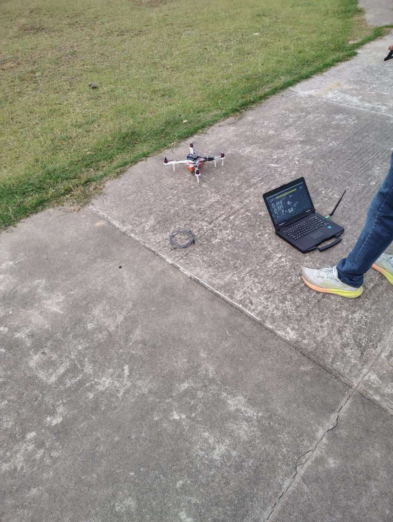

# AE-630 Autonomous Unmanned Aerial Systems

This repository contains coursework, simulation exercises, design studies, implementation work, and project documentation developed as part of **AE-630: Autonomous Unmanned Aerial Systems**.

The repository serves as a centralized collection of materials covering UAV simulation, flight control, quadrotor design, component selection, fabrication, testing, and system-level integration.

---

# Repository Structure

```text
AE-630-AUTONOMOUS-UNMANNED-AERIAL-SYSTEMS
│
├── Course Materials
│   ├── Quadrotor Design Code Development
│   │   ├── Conceptual Design of a Quadrotor.pdf
│   │   ├── Conceptual Design of Quad.ipynb
│   │   └── with optimal parameters.ipynb
│   │
│   ├── Design Fabrication and Experimental Validation of a Quadrotor.pdf
│   ├── Flight Test Video.txt
│   ├── Ranking of Evaluation Criteria for Design.pptx
│   └── umd_quad_design.pdf
│
├── Simulation Introduction
│   ├── docs
│   ├── images
│   ├── scripts
│   └── README.md
│
└── README.md
```
---


# Project Images

<table>
<tr>
<td align="center">
<br>
<b>Configuration</b>
</td>
<td align="center">
<br>
<b>Frame</b>
</td>
</tr>

<tr>
<td align="center">
<br>
<b>3D Printing</b>
</td>
<td align="center">
<br>
<b>Workbench and Assembly</b>
</td>
</tr>

<tr>
<td align="center">
<br>
<b>Weight Measurement</b>
</td>
<td align="center">
<br>
<b>Assembling And Electronics</b>
</td>
</tr>

<tr>
<td align="center">
<br>
<b>Flight Test 1</b>
</td>
<td align="center">
<br>
<b>Flight Test 2</b>
</td>
</tr>
</table>
---

# Course Materials

The **Course Materials** folder contains all documents, reports, presentations, design studies, implementation notebooks, and project-related resources used throughout the course.

---

## Quadrotor Design Code Development

This folder contains the computational and analytical work performed during the conceptual design stage of the quadrotor development process.

### Contents

### 1. Conceptual Design of a Quadrotor

This document presents the initial design methodology used for developing a quadrotor platform.

Topics covered include:

- Mission requirements
- Vehicle configuration selection
- Preliminary sizing
- Payload considerations
- Flight endurance estimation
- Weight budgeting
- Design trade-offs

---

### 2. Conceptual Design of Quad.ipynb

Jupyter notebook used for carrying out the conceptual design calculations.

The notebook includes:

- Design parameter calculations
- Mass estimation
- Thrust calculations
- Battery sizing
- Performance evaluation

---

### 3. with optimal parameters.ipynb

Enhanced version of the conceptual design notebook.

Includes:

- Optimized design parameters
- Refined calculations
- Performance improvements
- Selection of suitable components based on mission requirements

---

## Ranking of Evaluation Criteria for Design

This presentation discusses the methodology used to rank various design criteria before selecting the final quadrotor configuration.

Topics include:

- Evaluation framework
- Multi-criteria decision making
- Design trade-off analysis
- Weight assignment to design objectives
- Selection rationale

---

## UMD Quad Design Reference

The file:

```text
umd_quad_design.pdf
```

contains reference material used during the design process.

It provides insight into:

- Quadrotor design methodologies
- Vehicle sizing approaches
- Component integration
- Flight performance considerations

The document was used as a technical reference while developing the final design.

---

## Flight Test Video

The file:

```text
Flight Test Video.txt
```

## Flight Test Video

Watch the flight test video here:

[▶️ Flight Test Video](https://youtu.be/jtwIxyrpiis)

These videos demonstrate:

- Vehicle assembly
- Ground testing
- Flight validation
- Hover stability
- Control response evaluation

contains links and references to experimental flight test recordings.

These videos demonstrate:

- Vehicle assembly
- Ground testing
- Flight validation
- Hover stability
- Control response evaluation

---

# Simulation Introduction

The **Simulation Introduction** section provides a complete guide for building a UAV simulation environment using:

- ArduPilot SITL
- ROS2 Humble
- MAVROS
- Gazebo Harmonic

This module is intended for students and researchers who want to develop and test autonomous UAV algorithms in a simulated environment before deploying them on real hardware.

---

## Documentation

The `docs` directory contains step-by-step setup guides covering:

### 01 - ArduPilot SITL

- Installation
- Build process
- Simulation setup

### 02 - ROS2 System

- ROS2 Humble installation
- Environment configuration
- Workspace setup

### 03 - MAVROS Bridge

- MAVLink communication
- ROS integration
- Data exchange mechanisms

### 04 - Gazebo Simulator

- Gazebo Harmonic installation
- Physics engine configuration
- Simulation environment setup

### 05 - Gazebo-ArduPilot Integration

- Full simulation pipeline
- Vehicle spawning
- Sensor integration

### 06 - Basic Flight Control

- Python-based flight control examples
- Autonomous waypoint navigation
- Control commands

---

## Scripts

The scripts folder contains practical UAV control examples.

### Included Examples

#### Simple Takeoff

Demonstrates:

- Vehicle arming
- Mode switching
- Automated takeoff

---

#### Setpoint Position Control

Demonstrates:

- Position commands
- Coordinate frame usage
- Basic autonomous navigation

---

#### Waypoint Navigation

Demonstrates:

- Mission execution
- Sequential waypoint tracking
- Autonomous movement

---

#### Square Pattern Mission

Demonstrates:

- Path planning
- Multi-waypoint flight
- Closed-loop navigation

---

# Final Course Project

## Design, Fabrication and Experimental Validation of a Quadrotor

This document represents the culmination of the course and serves as the final project report.

The project covers the complete lifecycle of quadrotor development, beginning from conceptual design and continuing through fabrication, assembly, testing, and experimental validation.

### Major Activities

#### Conceptual Design

- Mission definition
- System requirements
- Initial sizing calculations
- Performance estimation

#### Design Evaluation

- Alternative design comparison
- Decision analysis
- Selection of final configuration

#### AHP-Based Decision Making

The project employs the **Analytic Hierarchy Process (AHP)** to evaluate and rank design alternatives.

Parameters considered include:

- Cost
- Weight
- Performance
- Reliability
- Manufacturability

This process ensures a systematic and quantitative design selection methodology.

#### CAD Modeling

Complete CAD models were developed for:

- Frame configuration
- Structural components
- Component placement
- Mechanical integration

#### Component Selection

Selection and procurement of:

- Brushless motors
- Electronic Speed Controllers (ESCs)
- Flight controller
- Propellers
- Power distribution components
- Battery system
- Communication modules

#### Fabrication and Assembly

Activities include:

- Structural fabrication
- Frame assembly
- Electrical integration
- Wiring and power distribution
- Sensor installation
- System verification

#### Experimental Testing

Validation tests include:

- Static testing
- Thrust verification
- System integration checks
- Flight readiness evaluation

#### Flight Testing

Practical flight experiments were conducted to evaluate:

- Hover performance
- Stability characteristics
- Control effectiveness
- System reliability
- Overall vehicle performance

#### Validation

The final results were compared against the design objectives to verify the effectiveness of the developed quadrotor platform.

---

# Learning Outcomes

Through this repository, the following topics are covered:

- UAV Design Methodology
- Conceptual Aircraft Design
- Quadrotor Dynamics
- Flight Control Systems
- ROS2 Middleware
- MAVROS Integration
- Gazebo Simulation
- Autonomous Navigation
- AHP-Based Decision Making
- CAD Modeling
- UAV Fabrication
- Experimental Validation
- Flight Testing

---

# Author

**Bhaskar**

AE-630 Autonomous Unmanned Aerial Systems (Course Instructor - Prof. Abhishek)

Indian Institute of Technology Kanpur (IIT Kanpur)

---

# License

This repository is intended for academic, educational, and research purposes.
